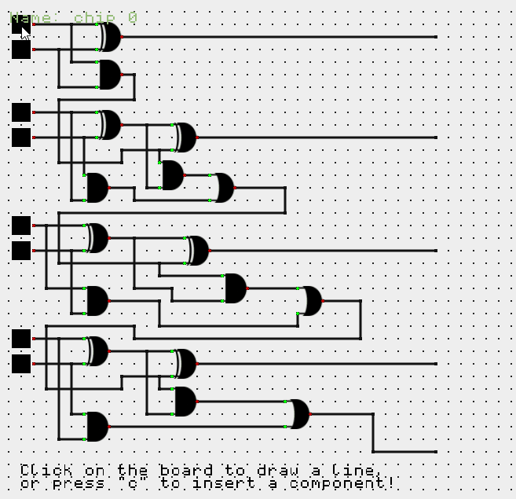

# Logic Gate Simulator in C++

This project uses [`cmake`](https://cmake.org/download/) for project building
so it must be installed as well a `c++17` (or greater) compliant `C++` compiler.

## Web Demo

4-bit Full Adder demo:



The latest deployed wasm builds are awailable on: <https://halidodat.github.io/gate/>

## Compiling to native build

Cloning the repository must be done recursively to get the dependecies.

```bash
git clone --recursive https://www.github.com/HalidOdat/gate.git
```

### Building though the terminal

Building the project, In the terminal type to configure `CMake`
```bash
cmake . -DCMAKE_BUILD_TYPE=Release -B build
```

To build you can either open the solution file with visual studio if you are on Windows,
Or use the command line to build it on windows and linux with:
```bash
cmake --build build --config Release
```

**NOTE**: Executing the program must be done in the same place that the assets directory is located.

On Linux:
```bash
./build/gate
```

On Windows:
```bash
./build/gate.exe
```

### Building though an IDE

Open directory where the root `CMakeLists.txt` is located with _Visual Studio_ (with the cpp development package installed) on Windows or _Visual Studio Code_ (with the cmake extensions) and build the project.

## Compiling to Wasm

Before being able to compile to you must have the [Emscripten SDK][emscripten] installed
and sourced (as described in the link).

```console
$ emcmake cmake . -B build-web
$ cmake --build build-web
$ cp web/index.html build-web
```

### Start a server

To be able to use the web version you need to start a server.
You can use `python`'s web server module.

```bash
python -m http.server -d build-web
```

Or upload it to a server.

[emscripten]: https://emscripten.org/docs/getting_started/downloads.html
